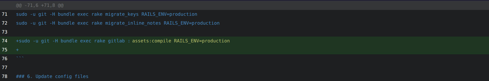

 

  
  <h3 align="center">Custom Vue.js Git diff visualizer</h3>

  

    Implementation of a custom Vue.js Git diff component
     
     
    <a href="https://github.com/pallandir/vue-git-diff/issues">Report Bug</a>
    ·
    <a href="https://github.com/pallandir/vue-git-diff/issues">Request Feature</a>
  

## About this project

For a specific use case, I needed to integrate a Git diff visualizer. While there are many great components available online, I wanted to build one from scratch to better understand how diffs work and to minimize external dependencies for such a simple feature.

This project is still a work in progress, with several improvements planned (see the roadmap). However, I'm quite happy with this first version and its current capabilities.

(<a href="#readme-top">back to top</a>)
